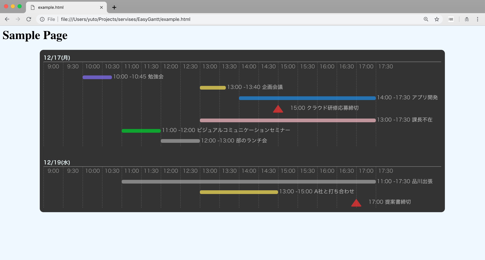

# PMK Gantt Chart

## How to Use

カラフルなバブルで近日中の予定やマイルストンを可視化します。

サーバを必要としないためブラウザのみで動作し、bootstrapやjQueryといったライブラリと依存関係がありません。インターネット無しで動作します。

分単位での予定の可視化にフォーカスしているため、短いスパンでの予定可視化・管理に向いています。




まずは、`/chart.js`に、何日からチャートを表示するのか、休み時間はいつなのか、時間の軸には何を表示するのかを記入してください。

```javascript
// 2018/12/7から開始する場合
let startDay = {
  year: 2018,
  month: 12,
  day: 7
}

// 画像のようなスケールでチャートを作成する場合
let timeScale = ["9:00", "9:30", "10:00", "10:30", "11:00", "11:30", "12:00", "12:30", "13:00",
                  "13:30", "14:00", "14:30", "15:00","15:30", "16:00", "16:30", "17:00", "17:30"];

// 12:00 - 13:00が休み時間の場合
let breakScale = ["12:00", "12:30"]
```

次に、`schedules.js`の配列に、予定するタスクを記入してください。
何もタスクがない日は、空の配列のままでOKです。

```javascript
let task = [
// 1日目
[
  // 1日目のタスクその1
  {
    name: "勉強会",
    startTime: 1000,
    endTime: 1045,
    category: "event"
  },
  // 1日目のタスクその2
  {
    name: "企画会議",
    startTime: 1300,
    endTime: 1340,
    category: "meeting"
  },
  // 1日目のタスクその3
  {
    name: "アプリ開発",
    startTime: 1400,
    endTime: 1730,
    category: "dev"
  },
  // 1日目のタスクその4
  {
    name: "クラウド研修応募締切",
    startTime: 1500,
    endTime: 1500,
    category: "milestone"
  },
  // 1日目のタスクその5
  {
    name: "課長不在",
    startTime: 1300,
    endTime: 1730,
    category: "absence"
  },
  // 1日目のタスクその6 時系列順である必要はありません
  {
    name: "ビジュアルコミュニケーションセミナー",
    startTime: 1100,
    endTime: 1200,
    category: "lecture"
  },
  // 1日目のタスクその7
  {
    name: "部のランチ会",
    startTime: 1200,
    endTime: 1300,
    category: "other"
  },
],
// 2日目 タスクがない場合は配列はからのまま
[],
```

`category`は次の7種類が用意されており、バブルの色と対応します。

 `dev 開発関係業務`

 `lecture レクチャーやセミナー`

 `meeting 会議`

 `event 何らかのイベント`

 `absence 誰かの不在予定`

 `other その他のタスク`

 `milestone 何かの期限`

milestoneは特別な`category`です。
バブルは表示せず、三角形で期限を示します。

## Get Start

1. ダウンロード&ファイル作成

```
$ git clone https://github.com/tachibanayu24/SimpleGantt.git

$ touch schedules.js
```

2. カスタマイズ

- [x] `chart.js`

コメントされている部分を変種

- [x] `schedules.js`

ファイル作成

`$ touch schedules.js`

task配列を書く

- [x] `chart.css` (お好みで)

## version

v1 => むきPで使える程度

v2 => 他の人に使ってもらえる程度

v3 => さらなる機能拡張

## ToDo

- [ ] 時間軸変えたらバブルの位置ずれるのなんとかする
- [ ] GitHub上では最小限のパーツだけ公開する。js読み込んで<div id="content"> だけ入れればそこにチャート出現。みたいな。